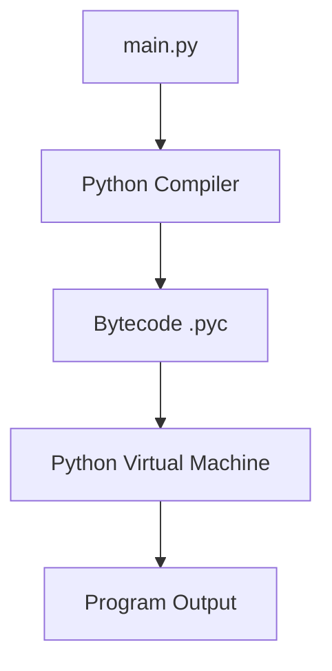

# Topics Covered

- [Module](#module)
- [PIP](#pip)
- [Comment](#comment)
- [Module vs Package](#module-vs-package)
- [REPL](#repl)
- [Python Workflow](#python-workflow)
---

# First Python code
```python
print("Hello World!")
```
---
# Module
A module is a python file containing code written by some body else (usually) which can be imported and used in our programs.
- There are two types of modules in Python:
	1. Built in Modules (Pre-installed in python)
	2. External Modules (Need to install using pip)

- Why use modules?
	- Reuse code instead of writing it again.
	- Keep programs organized.
	- Use code written by other developers.
```python
import math  # import math module to perform squre root

print(math.sqrt(25)) # output: 5.0
```
# PIP
- Pip is a **standard package manager** in python. 
- It is used to install, upgrade and manage python packages.
```bash
pip install flask # install flask module on the system
```
# Comment
Comments are used to write notes or explanations in code. Python ignores comments during execution.
- There are two type of comments
1. Single line comment 
2. Multi line comment
```python
# Single Line Comment
""" Multi
	Line
	Comment! """
```
# Module vs Package
- Module is a single file containing python code.
- A package is a collection of modules organized inside a folder.

# REPL
- Python can used as a calculator in terminal.  just type python and hit enter to open *REPL*.
- **REPL** $\rightarrow$ Read Evaluate Print Loop

# Python workflow

