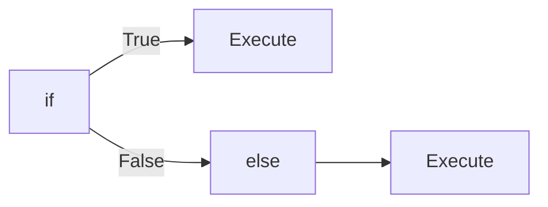
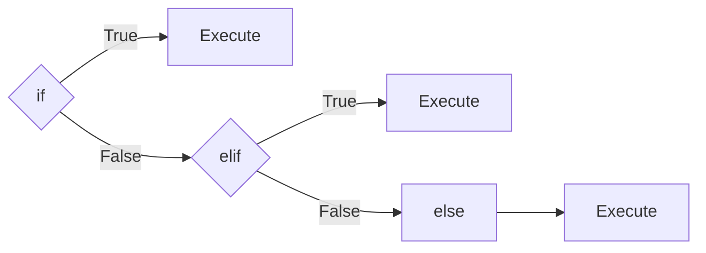
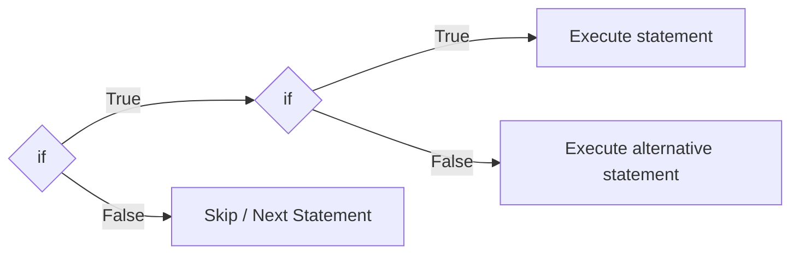

## Topics Covered

- [Conditional Statement](#conditional-statement)
  - [Condition](#condition)
  - [Types of Conditional Statements](#types-of-conditional-statements)
    - [if Statement](#if-statement)
    - [if-else Statement](#if-else)
    - [elif Clause](#elif-clause)
    - [Nested if](#nested-if)

- [Expressions in Conditionals]
  - [Ternary Conditional Expression](#ternary-conditional-expression)

- [Pattern Matching]
  - [match-case](#match-case)

- [Operators Used in Conditions]
  - [Relational Operators](#relational-operators)
  - [Logical Operators](#logical-operators)
    - [and](#and)
    - [or](#or)
    - [not](#not)
---
# Introduction
- In programming, we often need to make decisions based on certain conditions.
- Example: 
		If a user enters the correct password, they are allowed to log in.

# Conditional Statement
- A conditional statement executes a block of code when a specified condition is met.
## Condition 
- A condition is an expression that evaluates to either:
	- `True`
	- `False`
### Example: 
```python
	age = 18 
	print(age >= 18) # Here age >= 18 is a condition
	# Output: True
```
---
# Types of Conditional Statements
- `if`
- `if-else`
- `if-elif-else`
- Nested `if`
# Conditional Expression
- Ternary (Conditional )Expression

# Pattern Matching
- Match case

## if Statement
- `if` statement executes a block of code only when a condition is true.
### Syntax:
```python
if(condition is true):
	execute the statement
```

### Flow
```markdown
Condition True ---->  Execute Code
Condition False -----> Skip Code
```
### Example:
```python
age = 19

if age >= 18: 
	print("You are eligible to vote.")
```

## if-else
- `else` statement executes when the `if` condition is False.
### Syntax:
```python
if (condition is true):
	execute this statement
else:
	execute this statement
```

### Flow:

### Example: 
```python
age = 16
if age >= 18: 
	print("You are eligible to vote.")
else: 
	print("You are not eligible.") 
# Output: You are not eligible. (age 16 < 18)
```

## elif clause
- When there are multiple conditions, we use `elif`.
- `elif` in python means `else if`.
### Syntax: 
```python
if(condition A True):
	execute this statement
elif(condition B True):
	execute this statement
else:
	execute this statement
```
### Flow:


### Example: 
```python
marks = 85 
if marks >= 90: 
	print("Grade A") 
elif marks >= 75: 
	print("Grade B") 
elif marks >= 60: 
	print("Grade C") 
else: 
	print("Grade D")
# Output: Grade B
```

>**NOTE:**
>- There can be any number of elif statements.
>- The `else` block executes only if all `if` and `elif` conditions are False.
## Nested if
- An `if` statement inside another `if` statement is called a nested `if`.
- The inner `if` statement is checked only if the outer `if` condition is True.


### Syntax: 
```python
if(condition A True):
	if(condition B True):
		Execute statement 1 
	else: 
		Execute statement 2 # This is an alternative statement
```

# Ternary Conditional Expression

- A conditional expression is a single-line expression that returns one value if a condition is `True` and another value if it is `False`.
- This is a short form of `if-else`.
## Syntax:

```python
value_if_true if condition else value_if_false
```

## Example:

```python
age = 20

status = "Adult" if age >= 18 else "Minor"

print(status) # Output: Adult
```

## Match case
- match-case is used to compare a value against multiple cases and execute matching one.
- Used to choose between multiple alternatives.
### Example: 
```python
day = 3

match day:
    case 1:
        print("Monday")
    case 2:
        print("Tuesday")
    case 3:
        print("Wednesday")
    case _:                   # `_` acts as default case.
        print("Invalid day")
        
# Output: Wednesday
```

> **NOTE:**  
> `match-case` was introduced in Python 3.10.

# Relational Operators
Relational Operators are used to evaluate conditions inside the if statements.

| Operator | Meaning                  |
| -------- | ------------------------ |
| ==       | Equal to                 |
| !=       | Not Equal to             |
| >        | Greater than             |
| <        | Less than                |
| >=       | Greater than or Equal to |
| <=       | Less than or Equal to    |

# Logical Operators

## and
- True if both operands are true else False.
### Example:
```python
age = 25

if age >= 18 and age <= 60:
    print("Working age group")
```
## or
- True if at least one operand is True, otherwise False.
## Example:
```python
marks = 90

if marks > 80 or marks == 80:
    print("Excellent")
```
## not
- Converts `True` to `False` and `False` to `True`.
### Example:
```python
is_logged_in = False

if not is_logged_in:
    print("Please log in")
```

> **NOTE:**
> - Python uses indentation (spaces) to define code blocks.
>- Incorrect indentation will raise an error.

