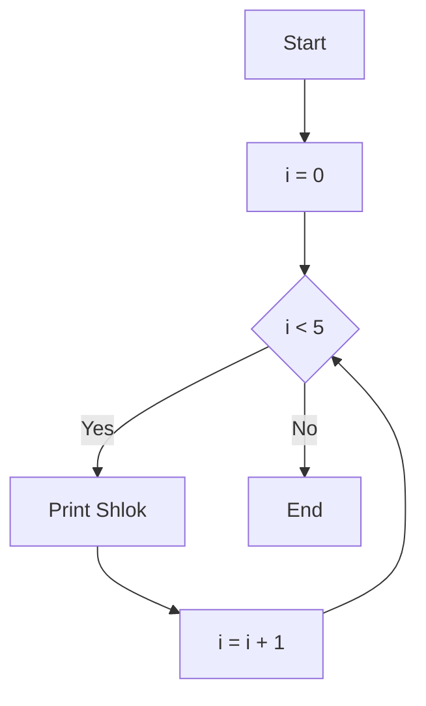
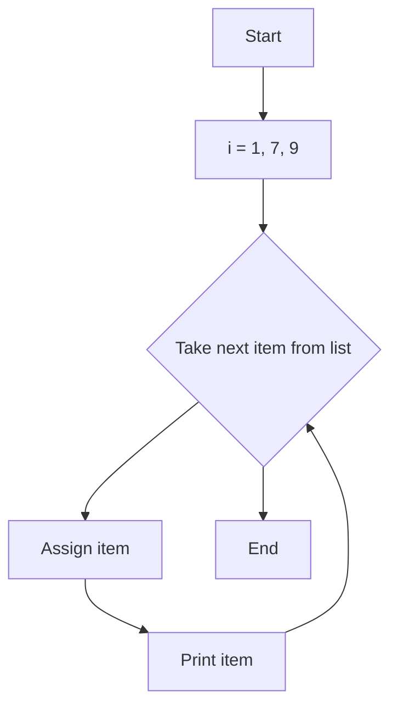

## Topics Covered

- [Loops](#loops)
  - [Types of Loops](#types-of-loops)
    - [while Loop](#1-while-loops)
    - [for Loop](#2-for-loops)
  - [Range Function](#range-function)
  - [for Loop with else](#for-loop-with-else)
  - [break Statement](#break-statement)
  - [continue Statement](#continue-statement)
  - [pass Statement](#pass-statement)
---
# Loops
- A loop is a way to execute a block of code multiple times without writing again and again.

# Types of Loops
- There are two main types of loops in Python:
1. `while` Loops
2.  `for` Loops

## 1. while Loops
- `while` loops first check the condition. If it's true then executed otherwise not.
- If condition true, it keeps executed until the condition become false.
### Syntax:
```python
while(condition):
	body of the loop
```

### Example: 
```python
i = 0;
while i < 5: 
	print("Shlok")
	i += 1
```

>**NOTE:**  
>- `i += 1` means `i = i + 1` (increment by 1)
>- `i -= 1` means `i = i - 1` (decrement by 1)
>- `i *= 2` means `i = i * 2`

### Flow:


>**NOTE:**  
>- If condition never becomes false the loop keeps executing and This is called *infinite loop*.
---
## 2. for Loops
- A `for` loop is used to repeat code for each item in a sequence like list, string, tuple, or range.
### Example: 
```python
i = [1,7,9]

# item is a temporary variable that holds each value one by one

for item in i: 
	print(item) 
'''	
Output:
1
7
9
'''
```



---
# Range function
- `range()` function in python used to generate a sequence of number.
## Syntax:
```python
range(start, stop, step_size) 

# step_size is optional (default value = 1)
# stop value is not included in output
```

## Example: 
```python
for i in range(0,5):
	print(i)
'''
Output: 
0
1
2
3
4
'''

#------------- RANGE WITH STEP_SIZE -------------

for i in range(0,7,2): # skip 1 element
	print(i)
'''	
Output: 
0
2
4
6
'''
```
---
# for Loop with else
- An optional `else` can be used with a for loop.
- `else` executed when the loops exhausts.
## Example: 
```python
i = [1,7,9]
for item in  i:
	print(item)
else:
	print("Done") # This print when loops finishes without break.
	
'''
Output:
1
7
9
Done
'''
```
---
# break Statement
- `break` is used to come out of the loop.
- It tells the program to exit the loop.
## Example:
```python
for i in range(0,10):
	print(i)
	if i == 4:
		break
'''
Output:
0
1
2
3
4
'''
```
---
# continue Statement
- `continue` is used to stop the current iteration of the loop and continue with the next one.
- It skips the current iteration and moves to next one.
## Example: 
```python
for i in range(0,5):
	if i == 3:
		continue
	print(i) # 3 is skipped because `continue` skips that iteration
'''
Output: 
0
1
2
4
'''
```
---
# pass Statement
- `pass` is a null statement in python.
- `pass` is used when Python expects a block but you don’t want to write code yet.
## Example: 
```python
i = [1,2,7]
for item in i: # without pass it would cause an error 
	pass  # used as a placeholder
```

>**NOTE:**  
>In Python, indentation is very important because it defines the block of code inside a loop.