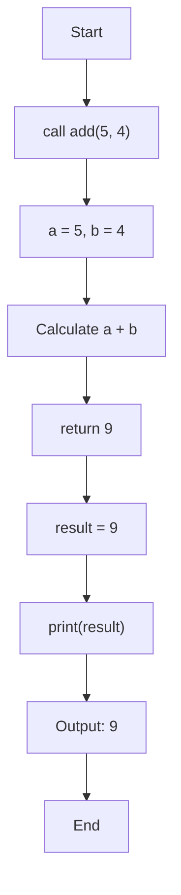
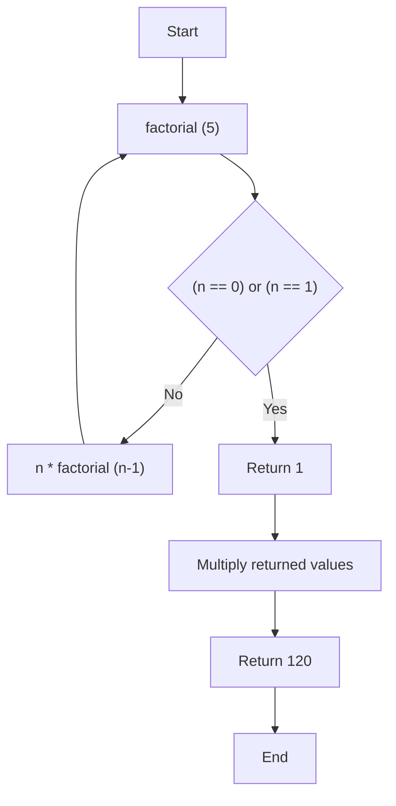

## 📚 Covered Topics

- [Function](#function)
  - [Function Definition](#function-definition)
  - [Function Call](#function-call)
  - [Types of Functions](#types-of-functions)
  - [Function with Parameters](#function-with-parameters)
    - [Default Parameters](#default-parameters)
  - [Return Statement](#return-statement)
  - [Local and Global Variables](#local-and-global-variables)
    - [Local Variable](#local-variable)
    - [Global Variable](#global-variable)
  - [Recursion](#recursion)
    - [Base Case](#base-case)
---
# Function
- A function is a reusable block of code performing a specific task.
- Functions help to avoid code repetition.
- A function executes only when it is called.
## Syntax:
```python
def func1():
	print("Hello")
```
## Example:
```python
#----------- CODE REPETITION --------------
print("I am learning python!")
print("I am learning python!")
print("I am learning python!")

# ----------- FUNCTION --------------------
def say():
	print("I am learning python!")

say() # we can call function many times.
say()
say()
```

# Function Definition
- A function definition is the code written inside a function.
- It specifies what the function will do when it is called.
- A function is defined using the `def` keyword.
## Example: 
```python 
def greet():  # <--- function definition
	print("Good morning")  
	
greet() # <--- function call
```
# Function Call
- To call a function we put the name of the function followed by parentheses.
## Syntax: 
```python
func1() # This is a function call
```

# Types of Functions

- There are two types of functions in Python:
	- **Built-in Functions**
		- Already present in Python.
		- Examples: `len()`, `print()`, `input()`

	- **User-defined Functions**
		- Created by the user.
		- Example: `func1()`

# Function with Parameters
- It allows us to pass data to a function.
## Example: 

```python
def greet(name): # 'name' is a parameter
    print("Hello", name)

greet("Shlok") #'shlok' is an argument

# Output: Hello Shlok
```

>**NOTE:**  
>- **Parameter:** Parameters are the variables listed in the function definition.
>- **Arguments:** Arguments are the actual values passed when calling the function.

## Default Parameters
- A default parameter has a predefined value.
- If no value is passed, the default value is used.
### Example:
```python
def greet(name="Guest"):
	print("Hello", name)

greet() # Output: Hello Guest
greet("shlok") # Output: Hello shlok
```

# Return Statement
- The `return` statement sends a value back to the place where the function was called.
## Example:
```python
def add(a, b): 
	return a + b  # <-- return a+b to result
	
result = add(5, 4)

print(result) # Output: 9
```

## Flow



# Local and Global variables
## Local variable
- Created inside a function. 
- Can only be used inside that function.
### Example:
```python
def func():
	x = 10 # <--- local variable
	print(x)

func() # Output: 10

print(x) 
# Output: NameError: name 'x' is not defined
```

## Global variable
- Created outside a function.
- Can be accessed from anywhere in the program.
### Example:
```python
x = 10 # <--- global variable

def func():
	print(x)

func() # Output: 10
print(x) # Output: 10
```

>**NOTE:**  
>- Local variables exist only while the function is running.
>- After the function finishes, those variables are destroyed.


# Recursion
- Recursion is a technique where a function calls itself.
- Recursion is useful for solving problems that can be broken into smaller versions of the same problem.
- It follows a mathematical definition.
	- `factorial(n) = n x factorial(n - 1)`

## Base Case
- The base case is the condition that stops recursion.
- Without a base case, recursion will continue forever.
## Example: 
```python
def factorial(n):
	if n == 0 or n == 1: # <--- Base case
		return 1
	else: 
		return n*factorial(n-1)

print(factorial(5)) # Output: 120
```
## Flow


>**NOTE:**  
>- A recursive function must have a base case.
>- Otherwise, Python raises a `RecursionError`.

